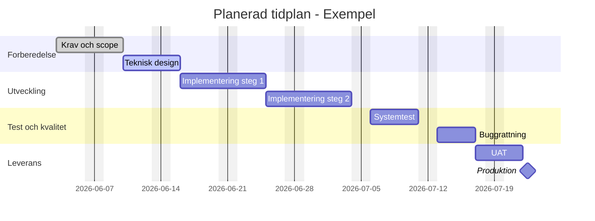

# Planerad Tidplan - Gantt (Mall)

Nedan finns en mall i Mermaid-format som kan visas i er HTML-preview.
Du kan kopiera blocket och byta namn, datum och varaktighet.

## Snabbguide

1. Byt aktiviteter i varje section.
2. Satt startdatum (YYYY-MM-DD) eller anvand after aktivitet_id.
3. Andra varaktighet med d (dagar), t.ex. 10d.
4. Anvand milestone for viktiga leveranspunkter.
