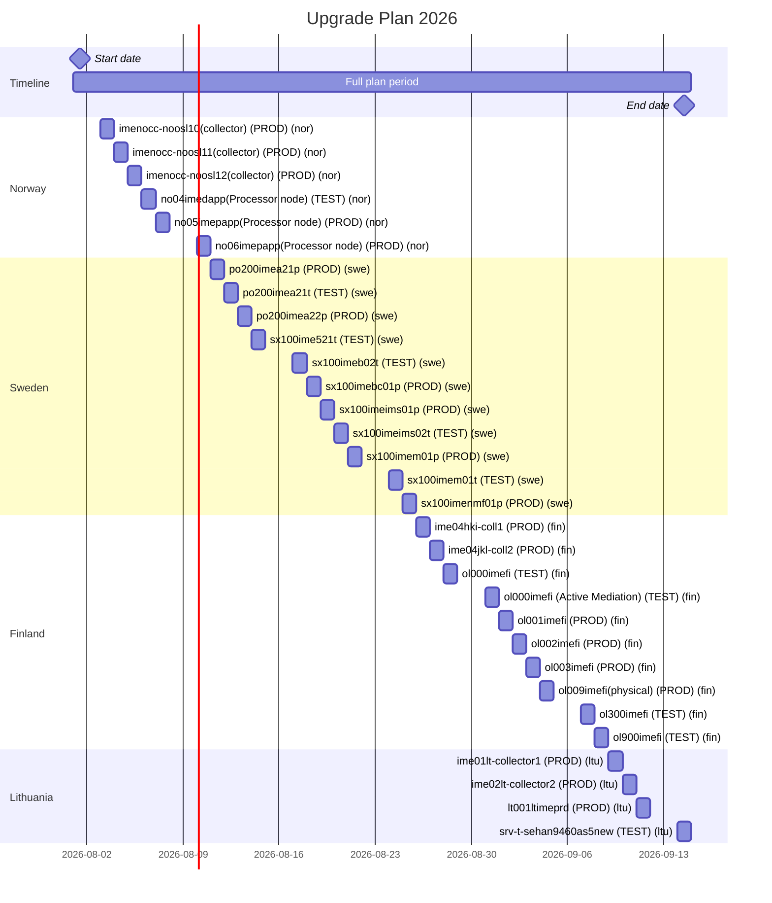

# Gantt chart by country

All countries in one view with filtering in the HTML view.

```mermaid
gantt
    title Upgrade Plan 2026
    dateFormat  YYYY-MM-DD
    axisFormat  %Y-%m-%d

    section Timeline
    Start date                                  :milestone, frame_start, 2026-08-01, 1d
    Full plan period                            :frame_period, 2026-08-01, 45d
    End date                                    :milestone, frame_end, 2026-09-14, 1d

    section Norway
    imenocc-noosl10(collector) (PROD) (nor)       :norway_1, 2026-08-03, 1d
    imenocc-noosl11(collector) (PROD) (nor)       :norway_2, 2026-08-04, 1d
    imenocc-noosl12(collector) (PROD) (nor)       :norway_3, 2026-08-05, 1d
    no04imedapp(Processor node) (TEST) (nor)      :norway_4, 2026-08-06, 1d
    no05imepapp(Processor node) (PROD) (nor)      :norway_5, 2026-08-07, 1d
    no06imepapp(Processor node) (PROD) (nor)      :norway_6, 2026-08-10, 1d

    section Sweden
    po200imea21p (PROD) (swe)                     :sweden_1, 2026-08-11, 1d
    po200imea21t (TEST) (swe)                     :sweden_2, 2026-08-12, 1d
    po200imea22p (PROD) (swe)                     :sweden_3, 2026-08-13, 1d
    sx100ime521t (TEST) (swe)                     :sweden_4, 2026-08-14, 1d
    sx100imeb02t (TEST) (swe)                     :sweden_5, 2026-08-17, 1d
    sx100imebc01p (PROD) (swe)                    :sweden_6, 2026-08-18, 1d
    sx100imeims01p (PROD) (swe)                   :sweden_7, 2026-08-19, 1d
    sx100imeims02t (TEST) (swe)                   :sweden_8, 2026-08-20, 1d
    sx100imem01p (PROD) (swe)                     :sweden_9, 2026-08-21, 1d
    sx100imem01t (TEST) (swe)                     :sweden_10, 2026-08-24, 1d
    sx100imenmf01p (PROD) (swe)                   :sweden_11, 2026-08-25, 1d

    section Finland
    ime04hki-coll1 (PROD) (fin)                   :finland_1, 2026-08-26, 1d
    ime04jkl-coll2 (PROD) (fin)                   :finland_2, 2026-08-27, 1d
    ol000imefi (TEST) (fin)                       :finland_3, 2026-08-28, 1d
    ol000imefi (Active Mediation) (TEST) (fin)    :finland_4, 2026-08-31, 1d
    ol001imefi (PROD) (fin)                       :finland_5, 2026-09-01, 1d
    ol002imefi (PROD) (fin)                       :finland_6, 2026-09-02, 1d
    ol003imefi (PROD) (fin)                       :finland_7, 2026-09-03, 1d
    ol009imefi(physical) (PROD) (fin)             :finland_8, 2026-09-04, 1d
    ol300imefi (TEST) (fin)                       :finland_9, 2026-09-07, 1d
    ol900imefi (TEST) (fin)                       :finland_10, 2026-09-08, 1d

    section Lithuania
    ime01lt-collector1 (PROD) (ltu)               :lithuania_1, 2026-09-09, 1d
    ime02lt-collector2 (PROD) (ltu)               :lithuania_2, 2026-09-10, 1d
    lt001ltimeprd (PROD) (ltu)                    :lithuania_3, 2026-09-11, 1d
    srv-t-sehan9460as5new (TEST) (ltu)            :lithuania_4, 2026-09-14, 1d
```

HTML view (production): tidplan_gantt_status_per_land.html
HTML view (planning): tidplan_gantt_kalkyl.html
